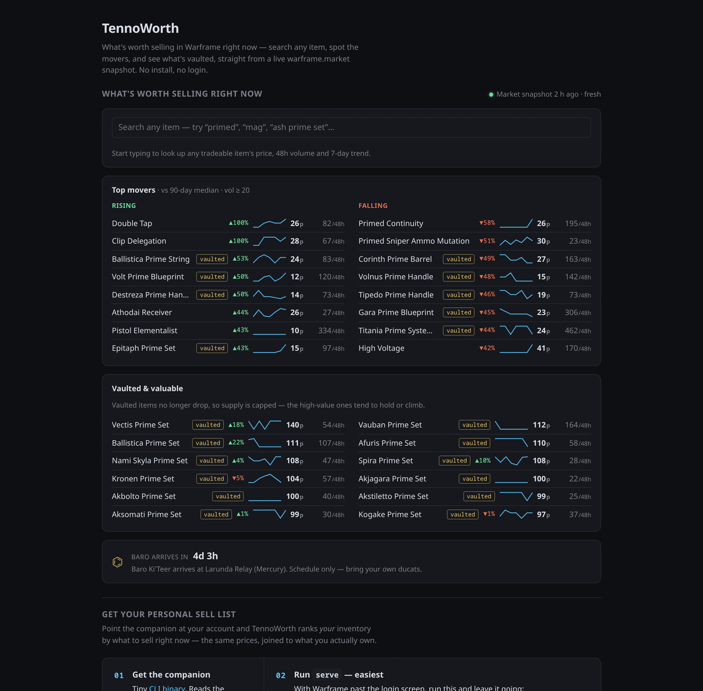
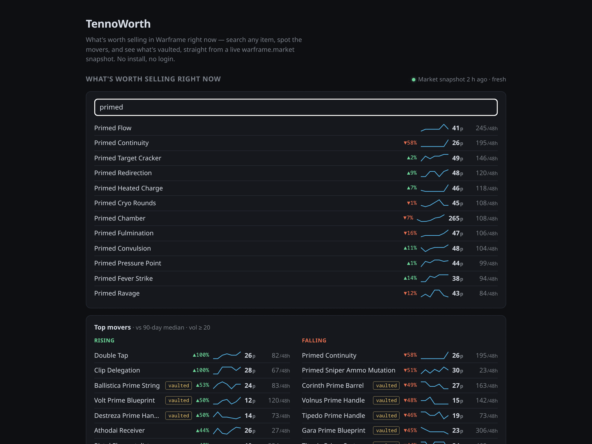

# TennoWorth

A cross-platform **Windows + Linux** Warframe inventory + market dashboard —
the no-Overwolf alternative to AlecaFrame. It answers one question better than
anything else: **what should I sell right now?**

Your inventory is read locally by the desktop app (it memory-scans the running
game — nothing is uploaded, no account login to *us*). It joins your inventory
against a live warframe.market price snapshot and ranks your items by expected
plat, not by a raw average price. Runs on Steam Deck.

**Try the informational site** at **[tennoworth.app](https://tennoworth.app)** —
a full market browser: prices, 48-hour volume, 7-day trend sparklines, vaulted
items, and the Baro countdown, straight from a snapshot refreshed every 2
hours. No download, no login, no account. Want *your* inventory ranked? That's
the desktop app.

<p align="center">
  
</p>

Search any tradeable item for its price, volume, and trend — no download, no
login:

<p align="center">
  
</p>

## How it works

```
Warframe (running)  ──►  desktop app (Tauri)  ──►  "what to sell"
                            │  reads game memory    │
                            │  wfm-core              └──► create/edit
                            ▼                              WFM listings
                       market.json
                       (refreshed on a cron)
```

- **`companion/`** — a Rust workspace. `wfm-core` is the reusable core (scan,
  inventory fetch, WFM auth with encrypted JWT, listings, pending plans);
  `tennoworth-desktop` is the Tauri v2 app that drives it over IPC — the only
  adapter. PC-only by nature — it reads game memory. See
  [`companion/README.md`](companion/README.md).
- **`prototype/`** — the Svelte web app, deployed as the informational site.
  No backend, no accounts, no data leaves your machine.
  `prototype/public/market.json` is the shared price snapshot.

## Desktop app

The desktop app is the product. Install it per platform:

- **Windows** — an installer (`.exe`) or `.msi` from the
  [latest release](https://github.com/tennoworth/tennoworth/releases/latest).
  Unsigned, so SmartScreen warns on first run (see
  [`SECURITY.md`](SECURITY.md)). The app updates itself from there.
- **Linux** — your distro's own package manager, from signed repositories.
  Updates arrive with the rest of your system; the in-app updater deliberately
  stays quiet on Linux.

**Debian / Ubuntu**

```bash
curl -fsSL https://tennoworth.app/tennoworth-archive-keyring.asc \
  | sudo tee /etc/apt/keyrings/tennoworth.asc > /dev/null
echo "deb [signed-by=/etc/apt/keyrings/tennoworth.asc] https://tennoworth.app/apt stable main" \
  | sudo tee /etc/apt/sources.list.d/tennoworth.list > /dev/null
sudo apt update && sudo apt install tennoworth
```

**Fedora**

```bash
sudo dnf config-manager --add-repo https://tennoworth.app/rpm/tennoworth.repo
sudo dnf install tennoworth
```

**Arch** — [`packaging/aur/`](packaging/aur/): `tennoworth` builds from source,
`tennoworth-bin` uses the prebuilt binary.

The key fingerprint is published in [`SECURITY.md`](SECURITY.md) — worth
checking before you trust a key you downloaded over the network.

There is intentionally **no Linux AppImage**. It bundled the build machine's
ubuntu-22.04 WebKitGTK, which aborts at `EGL_BAD_PARAMETER` against a
rolling-release Mesa and shows a white window — inherent to shipping a
GPU-dependent stack built on another distro, not a bug a flag fixes. The deb
and rpm avoid this precisely because they *depend on* your system WebKitGTK
rather than carrying their own, exactly as the AUR packages do.

Note the package is named `tenno-worth` internally (Tauri derives it from the
product name and offers no override), but both packages declare
`Provides: tennoworth`, so `apt install tennoworth` resolves correctly.

## Develop

```bash
cd prototype && bun install && bun run dev   # http://127.0.0.1:5173
```

Security posture and threat model: [`SECURITY.md`](SECURITY.md).

### Branching

This repository uses a develop-then-main promotion model — `develop` is the
integration branch (feature branches merge here, CI runs here), `main` is
production (auto-deploys), and promotion is fast-forward only.

## Ban risk

The desktop app only reads: game memory for the inventory scan, and the
game's own text log (`EE.log`) for trade detection. It never writes to the
game, never injects.
**We can't promise it's ban-safe.** Equivalent tools
([warframe-api-helper](https://github.com/Sainan/warframe-api-helper) and
AlecaFrame via Overwolf) have run for years with no documented bans, but DE
has never formally blessed this category of tool. **Use at your own risk; no
warranty.**

For a detailed breakdown of what the desktop app reads and what never leaves
your machine, see the in-app 'Trust & safety' section.

## License

MIT.
