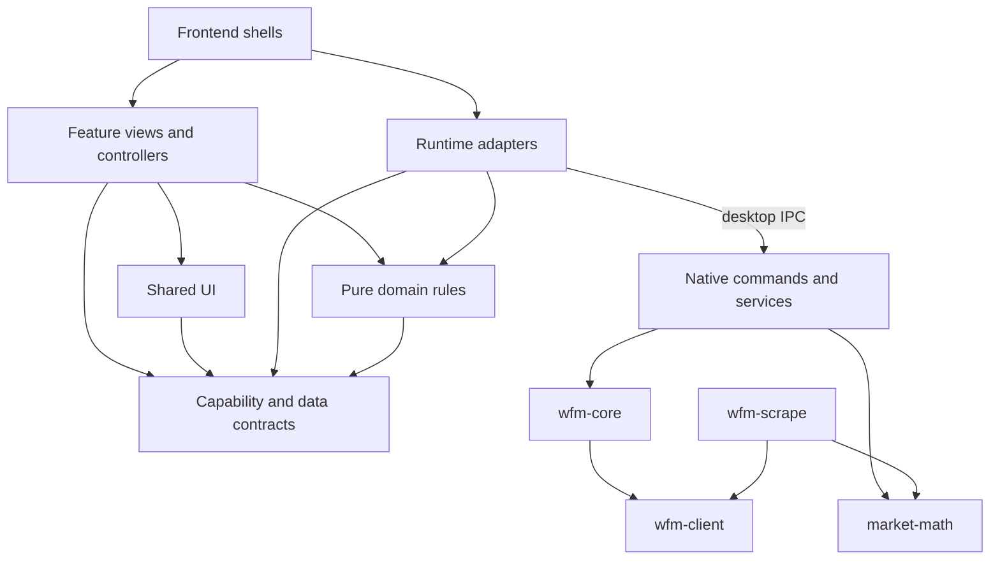

# Architecture and ownership

TennoWorth has three runtime surfaces: a public hosted site, an installed
Windows/Linux desktop app, and its reward overlay. The desktop owns account
operations. A separate host pipeline publishes static market data. There is
no user-account backend and the site never receives inventory.

## Repository map

```text
frontend/
  src/
    main.ts                  runtime selection and dynamic entry loading
    shells/                  desktop and hosted composition; shared shell CSS
    features/                inventory, selling, orders, relics, rivens,
                             market-context, watches, ledger, settings
    domain/                  deterministic calculations and resolution
    contracts/               wire shapes, capabilities, errors, state interfaces
    adapters/                Tauri IPC, same-origin loading, persistence
    ui/                      shared visual primitives and capability context
    dev/                     sample transport, styleguide, architecture gates
  public/                    published market/catalog data and static assets
  tests/browser/             styled runtime and visual regression checks
rust/
  tennoworth-desktop/src/
    shell/                   startup, tray, updates, probes
    commands/                IPC entry points and input validation
    services/                inventory state, watches, trades, notifications
    persistence/             schema, record types, table operations, key storage
    overlay/
      capture/               platform frame acquisition
      recognition/           OCR, parsing, matching, result assembly
      presentation/          native windows and Wayland presentation
      lifecycle.rs           capture exclusion and current-result identity
  wfm-core/src/
    acquisition/             process scan and DE inventory acquisition
    trading/                 authentication, catalog, orders, plans, recovery
  wfm-scrape/src/
    ingest/                  upstream transport and source-specific adapters
    pipeline/                build orchestration, root discovery, publication
  market-domain/             inventory, scoring, advisor and planning decisions
  market-math/               pure shared heuristics
  wfm-client/                shared request policy and transport primitives
scripts/                     release, CSP, probe and deployment checks
tests/fixtures/             shared parity and pipeline inputs/expectations
deploy/                      live-data refresh and deployment operations
```

## Runtime shape

Three runtime surfaces share one codebase: a public hosted site, an installed
Windows/Linux desktop app, and the in-game reward overlay. Host inventory is
acquired by scanning the running game process; the hosted surface never sees it.

```
┌─ Warframe game ──────────────────────────────────┐
│   /proc/<pid>/mem  or  ReadProcessMemory         │
└────────────────────────┬─────────────────────────┘
                         │ scrape accountId+nonce
                         ▼
        ┌── desktop app (tennoworth-desktop, Tauri) ──┐
        │  same-origin webview (the SPA)              │
        │  scan_inventory → wfm-core → IPC            │
        │  wfm_login → wfm-jwt.enc (AES, Rust-side)   │
        │  listing / orders → wfm-core → WFM          │
        └────────────────────────┬────────────────────┘
                                 │
                 ┌───────────────┴──────────────────┐
                 ▼                                 ▼
       ┌── informational site (frontend/) ──┐    market.json
       │  market browse + desktop showcase    │    (published by the host
       │  no accounts, no files, no scan      │     pipeline on a schedule)
       └──────────────────────────────────────┘
                            ▲
                            │ GET market.json
              ┌─────────────┴────────────────────────────┐
              │  wfm-scrape scrape  (Rust)               │
              │  → CSV → wfm-scrape build                │
              └──────────────────────────────────────────┘
```

The desktop app is the only interactive product. The standalone companion CLI
(`wfm-fetch-inventory` with `fetch`/`login`/`serve`) was removed on 2026-08-02,
and the dormant advisor command and implementation were removed after it. The
hosted site is informational only - no accounts, no file access, no scan - and
`market.json` plus `wfstat-catalog.json` are the artifacts it consumes.

## CI inventory

`.github/workflows/` holds the release and verification workflows:
`release-desktop` (desktop artifacts, cut on `desktop-v*` tags), `build-web`,
`build-scrape`, `build-usage`, `audit`, `ui-smoke`, and the on-demand
`ocr-windows-test` and `publish-wfm-policy`. Shared composite actions live in
`.github/actions/`: `setup-rust`, `setup-windows-ocr` and
`publish-rolling-release`, which the workflows above call into.

Cache policy, trigger paths and the ruleset configuration are owned elsewhere:
see [rust-toolkit-2026-lessons.md](rust-toolkit-2026-lessons.md) for the CI
cache measurements and [github-rulesets/](github-rulesets/) for the applied
repository rulesets.

## Dependency direction



Shells choose implementations and provide desktop services through Svelte
context. Features consume typed capabilities; they do not import concrete
adapters. Pure domain rules receive their inputs, including timestamps, instead
of reading storage, clocks, the network, or UI state. Contracts can reference
shared domain types without creating runtime dependencies.

The hosted adapter exposes public market/history loading only. It does not
pretend to support scanning, authentication, or orders through no-op methods.
Desktop services and the standalone overlay are dynamically loaded. Overlay
document styles are surface-scoped so they cannot disable hosted-page scrolling.

`frontend/src/dev/architecture.test.ts` checks static import cycles, direct
feature/adapter separation, pure-domain runtime access, hosted transitive
imports, and production component type-check coverage. This is a bounded
static gate: it does not establish runtime lifecycle correctness or inspect
arbitrary dynamic imports. Behavior and browser tests cover those concerns.

## Feature state and composition

The desktop shell composes views and navigation. Inventory acquisition/loading,
listing authentication and interrupted-plan recovery, and persisted filter
preferences live in their respective feature controllers. Dependencies are
injected so failures and overlapping operations can be exercised without
native IPC. Other feature panels retain local state close to their views;
there is no new all-purpose application store.

Shared UI belongs in `ui/` only when multiple features need the same visual
contract. Domain calculations do not belong in a component or generic utility
bag. Transport helpers belong in adapters, even when several features use them.
`data-shell` preserves the ownership of extracted shell styles; do not add it
to feature internals to work around styling boundaries. The
[design system](design-system.md) specifies tokens and composition patterns.

## Native responsibilities

The executable entry delegates to `shell/`. Commands remain the IPC boundary;
services coordinate background work and shared state. Persistence owns the
SQLite connection, migration SQL, record formats, and operations grouped by
table family. Moving an operation does not change its transaction semantics.

Overlay capture selects a Windows, X11, or unsupported backend at compile time.
Recognition owns Tesseract and item matching. Presentation owns window behavior,
including Wayland-specific rendering. Lifecycle state keeps capture exclusion
separate from the identity of the currently displayed result: finishing a
capture must not implicitly clear or replace that identity.

`wfm-core` stays usable without terminal prompts or a Tauri dependency. Its
acquisition and trading modules share narrowly named HTTP, identity, path, and
time helpers. `wfm-client` shares transport primitives, not an abstraction that
combines anonymous scraping with authenticated order mutation. `market-math`
has no I/O or clock dependency. `market-domain` is the sixth workspace member:
it isolates decision contracts and computations from both Tauri and the network
core, so shared fixtures and contract generation can run without the GUI stack.

## Data and failure boundaries

The pipeline ingests upstream data, validates and builds the snapshot, then
publishes the resolver catalog before the market file. CSV is intermediate
input; `market.json` and `wfstat-catalog.json` are the consumer artifacts.
Freshness is attached to the evidence actually fetched. Unavailable, malformed,
unchanged, and authoritative-empty inputs are distinct outcomes.

Hosted data comes from the same origin. Desktop network access stays in Rust;
the webview uses capabilities. JWTs and game session secrets remain on the
native side and must not enter logs. Listing plans persist before the first
mutation and after each item so interrupted batches remain recoverable.

This reorganization preserves IPC command names, database migrations, stored
keys, encrypted envelopes, and published data shapes. Tests must consume the
current implementation, including freshly built binaries where applicable.
Shared cross-language behavior uses fixtures under `tests/fixtures/`.

## Structural choices and remaining limits

The old single application component mixed runtime selection, feature state,
and presentation. Separate shells and feature controllers make those decisions
explicit. Generic `lib/` and native utility buckets hid ownership; named domain,
adapter, service, and persistence modules replace them. The dormant advisor
command and its unused implementation were removed instead of carrying an
unreachable integration surface.

A folder split alone cannot prevent coordination bugs. Preserve tests for
concurrent scans, failed authentication, interrupted listing recovery, stale
results, and error states whenever ownership changes. Browser previews cannot
certify native capture; Windows and Linux runtime checks remain separate.

The root rename affects deployment paths as well as imports. The installed
puller refuses an unattended layout transition and retains live data during an
explicit migration. Follow [repository-layout-transition.md](repository-layout-transition.md)
for promotion and rollback; a source merge is not permission to migrate a host.

See [CONTRIBUTING.md](../CONTRIBUTING.md) for contribution tiers and executable
setup/check commands.

## Native decision boundary

Desktop inventory normalization, sell-row facts, Trade Session selection,
calendar advice and relic/set/ducat/build plans run through `evaluate_domain`.
The registry in `rust/market-domain/src/dispatch.rs` defines a tagged request and
matching response together. The command computes on a blocking worker and never
executes orders; existing listing validation, account state and recovery remain
the authority for mutations.

Frontend adapters serialize Maps and optional fields explicitly. Feature
controllers guard response generations, clear obsolete evidence, expose pending
or failed calculations, and preserve local editing state. UI filtering stays
synchronous over native facts. Market-only browsing and development previews
retain fixture-gated TypeScript counterparts; these are not production desktop
fallbacks when native computation fails.

`frontend/src/contracts/generated/` contains Rust-derived declarations. The
ordinary Rust tests compare them against current types. To update intentionally:

```sh
cd rust
TENNOWORTH_UPDATE_BINDINGS=1 cargo test -p market-domain domain_bindings_match_rust
TENNOWORTH_UPDATE_BINDINGS=1 cargo test -p tennoworth-desktop desktop_bindings_match_rust
```

The desktop binding pilot covers scan-report results, command errors and watch
notification payloads/event names. Existing commands outside that pilot keep
their current adapters; all newly migrated calculations use the generated
request/response registry. Generation preserves serialized optionality and field
names; it does not replace input validation. IPC uses JSON numbers, so large
integer inputs are bounded rather than represented as JavaScript bigint.

The real desktop smoke probe exercises all nine domain operations against shared
fixtures before completing its existing persistence/authentication checks. A
successful browser preview proves rendering and interaction behavior; it does
not establish that native IPC registration or serialization works.
